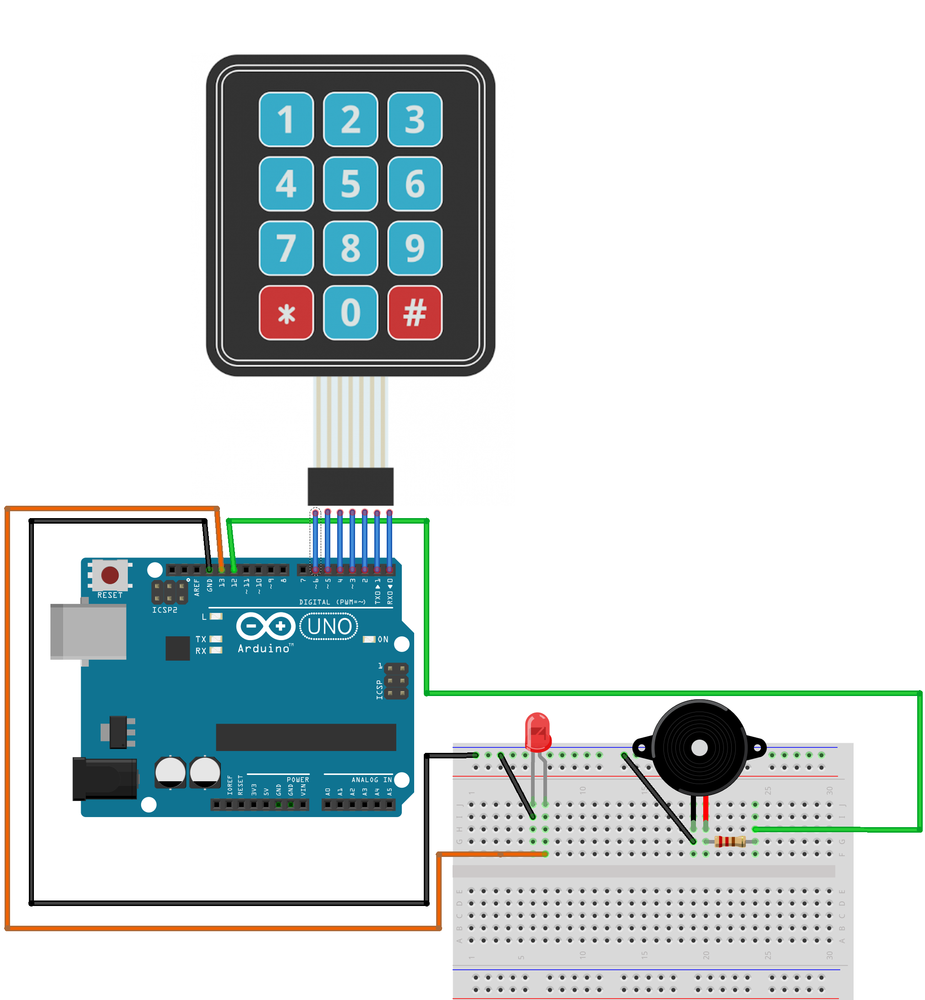
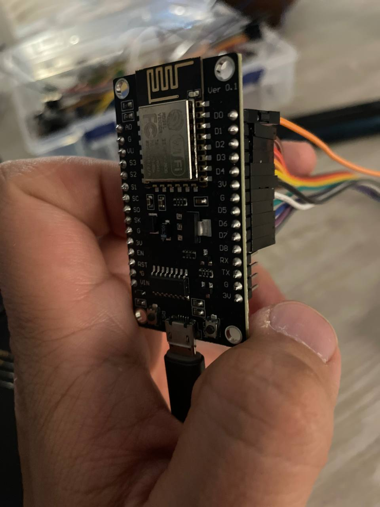

# Код для ESP8266 NodeMCU v3
Так же адаптировать под православный arduino можно поменяв рядки
```c
byte rowPins[ROWS] = { D1, D2, D3, D4 };
byte colPins[COLS] = { 14, 12, 13 };
```



ESP8266 для универсальной платы нужно использовать GPIO распиновку
В моём случае 
| Digital  | GPIO |
| ------------- | ------------- |
| D5  | 14  |
| D6  | 12  |
| D7  | 13  |


